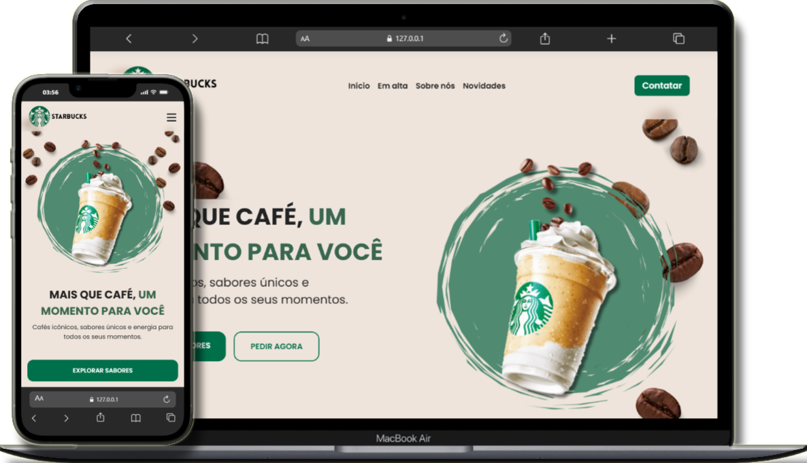

# ☕ Starbucks – Landing Page Responsiva

Este é um projeto de **landing page inspirada na identidade visual da Starbucks**, desenvolvido com foco em **responsividade**, **design moderno** e **interatividade** utilizando **HTML, SCSS e JavaScript Vanilla**.

O projeto foi criado seguindo a metodologia **Mobile First**, possui um menu responsivo no mobile, botões CTA personalizados, imagens decorativas e uma hero section com forte apelo visual.

---
## 🔗 Acesse o site

👉 **Link do projeto:** 
https://landing-page-starbucks-topaz.vercel.app/
---

## 🚀 Tecnologias Utilizadas

- **HTML5**
- **SCSS (Sass)**
- **JavaScript Vanilla**
- **Font Awesome** (ícones)
- **Google Fonts**

---

## 📸 Preview



## 📁 Estrutura de Pastas

```
/
├── index.html
├── src/
│ ├── assets/
│ │ └── images/
│ │ ├── logo.png
│ │ ├── background/
│ │ │ └── background-mobile.png
│ │ ├── hero/
│ │ │ └── coffee-cup.png
│ │ └── graos/
│ │ ├── grao_01.svg
│ │ └── grao_02.svg
│ ├── js/
│ │ ├── menuMobile.js
│ │ └── animacoes.js
│ └── scss/
│ ├── abstracts/
│ │ ├── _variables.scss
│ │ ├── _mixins.scss
│ │ └── _functions.scss
│ ├── base/
│ │ ├── _reset.scss
│ │ └── _global.scss
│ ├── components/
│ │ └── _buttons.scss
│ ├── layout/
│ │ ├── _header.scss
│ │ ├── _hero.scss
│ │ └── _footer.scss
│ └── style.scss
└── src/css/
└── style.css 
```

---

## 🧠 Funcionalidades

- 📱 **Menu mobile** com botão hambúrguer e animação  
- 🧭 **Navegação fluida** entre seções  
- 🎨 **Estética inspirada na Starbucks** com paleta verde e elementos decorativos  
- ⚡ **Hero Section moderna** com CTA duplo  
- 📐 **Totalmente responsivo** (Mobile → Desktop)  
- ✨ **Layout limpo e organizado com SCSS** usando o padrão 7-1  
- 🎭 **Elementos SVG decorativos** (grãos de café, blur, fundo)  
- 🔥 **Interações suaves** com transições e efeitos

---

## 📦 Como usar

1. Clone o repositório:

   ```bash
   git clone https://github.com/Carlos728293/landing-page-starbucks.git
   ```

2. Navegue até o diretório:

   ```bash
   cd landing-page-starbucks
   ```

3. Abra o arquivo `index.html` no navegador:
   - Pode usar uma extensão como "Live Server" no VSCode.
   - Ou simplesmente clique duas vezes no arquivo.

## 📝 Licença

Este projeto está sob a licença MIT. Sinta-se livre para utilizar, modificar e compartilhar!

---

### 💚 Feito com dedicação e café ☕
